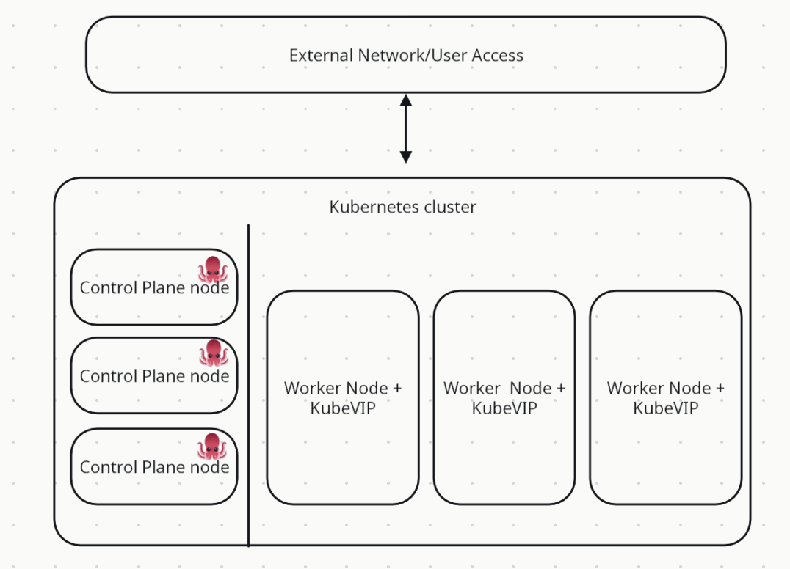
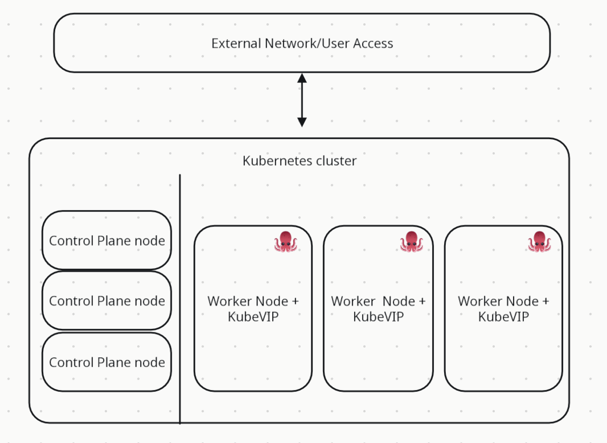
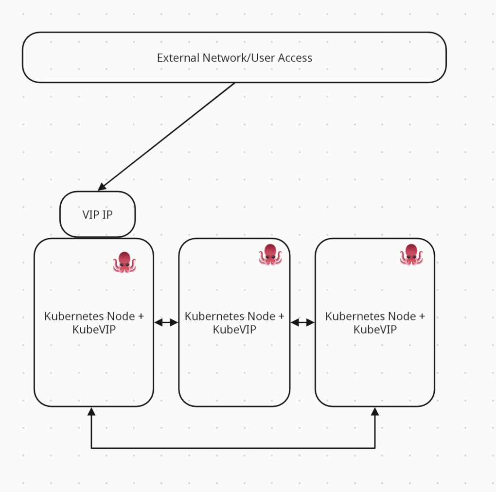
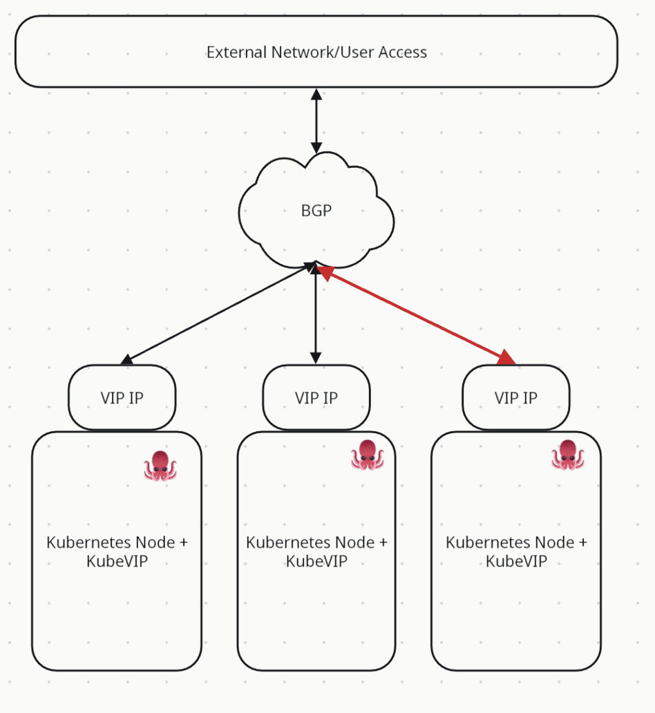

# Project documentation
Project acronym: *kube-vip* \
Authors: 
- Piotr Kowalczyk
- Wojciech Łoboda
- Aleksandra Smela
- Juliusz Wasieleski

Year: 2024/2025

## Contents list
- [Project documentation](#project-documentation)
  - [Contents list](#contents-list)
  - [1. Introduction](#1-introduction)
  - [2. Theoretical background/technology stack](#2-theoretical-backgroundtechnology-stack)
    - [kube-vip - What is it?](#kube-vip---what-is-it)
    - [What problem does kube-vip solves?](#what-problem-does-kube-vip-solves)
    - [How does kube-vip work?](#how-does-kube-vip-work)
    - [Overview of kube-vip functional components](#overview-of-kube-vip-functional-components)
    - [Architecture](#architecture)
  - [3. Case study concept description](#3-case-study-concept-description)
    - [**Testing Scenarios**](#testing-scenarios)
      - [1. **Round-Robin Load Balancing Across Pods**](#1-round-robin-load-balancing-across-pods)
      - [2. **Unreachable Pod Handling**](#2-unreachable-pod-handling)
      - [3. **Simulated Load Testing**](#3-simulated-load-testing)
    - [**Monitoring and Observability**](#monitoring-and-observability)
  - [4. Solution architecture](#4-solution-architecture)
  - [5. Environment configuration description](#5-environment-configuration-description)
  - [6. Installation method](#6-installation-method)
    - [6.1. Prerequisites](#61-prerequisites)
    - [6.2. Docker image building](#62-docker-image-building)
    - [6.3. Cluster and KubeVIP configuration](#63-cluster-and-kubevip-configuration)
    - [6.4. Cluster observability deployment](#64-cluster-observability-deployment)
    - [6.5. Telemetry setup](#65-telemetry-setup)
  - [7. Demo deployment steps](#7-demo-deployment-steps)
    - [7.1. Configuration set-up](#71-configuration-set-up)
      - [App deployment](#app-deployment)
    - [7.2. Data preparation](#72-data-preparation)
    - [7.3. Execution procedure and observability features access](#73-execution-procedure-and-observability-features-access)
      - [Accessing Grafana](#accessing-grafana)
      - [Accessing Jaeger](#accessing-jaeger)
      - [Simple app testing](#simple-app-testing)
    - [7.4. Results presentation](#74-results-presentation)
  - [8. Using AI in the project](#9-using-ai-in-the-project)
  - [9. Summary – conclusions](#10-summary--conclusions)
  - [10. References](#11-references)

## 1. Introduction
KubeVIP is a cloud-native high availability and load balancing solution built for Kubernetes environments, designed to provide resilient virtual IP addressing for both control plane components and service workloads across on-premises, edge, and multi-cloud deployments. By focusing on simplicity and platform independence, KubeVIP eliminates the need for external load balancers while ensuring critical Kubernetes components remain accessible even during node failures. It encompasses both control plane high availability and service load balancing capabilities, enabling organizations to build robust Kubernetes infrastructures without cloud provider dependencies. KubeVIP is platform-agnostic, operating effectively across bare metal, virtual machines, and various cloud environments. Its Kubernetes-native approach leverages either static pods or DaemonSets with support for multiple VIP advertisement methods including ARP, BGP, and Layer 2, enabling flexible network integration. KubeVIP aims to democratize high availability for Kubernetes clusters of all sizes, reducing operational complexity and costs associated with traditional load balancing solutions, ultimately enhancing resilience in both production and edge deployments.
## 2. Theoretical background/technology stack

### kube-vip - What is it? 
KubeVIP is a specialized tool that provides virtual IP address management and load balancing capabilities within Kubernetes environments. It delivers highly available endpoints for both Kubernetes control plane components and application services without relying on external load balancing infrastructure. By using cloud-native principles, KubeVIP ensures that critical Kubernetes components remain accessible even during node failures, making it particularly valuable for on-premises, bare metal, and edge deployments where traditional cloud load balancers aren't available.

### What problem does kube-vip solves?
High availability in Kubernetes environments traditionally requires external load balancers to provide stable entry points to the control plane and services. In cloud environments, this is typically handled by managed load balancing offerings, but in on-premises or edge deployments, these resources may not be available or may be prohibitively expensive.

KubeVIP addresses this gap by providing a Kubernetes-native solution that creates and manages virtual IP addresses that can float between nodes. This ensures continuous availability of the Kubernetes API server and services even when individual nodes fail. By eliminating the dependency on external load balancing infrastructure, KubeVIP simplifies the creation of highly available Kubernetes clusters in any environment, reducing complexity and cost while improving resilience.

### How does kube-vip work? 
KubeVIP tackles the high availability challenge through two main approaches:

1. It operates as either a static pod (for control plane HA) or a DaemonSet (for service load balancing), providing a consistent way to manage virtual IPs across the cluster regardless of the underlying infrastructure.

2. It supports multiple VIP advertisement methods (ARP, BGP, Layer 2) to accommodate different networking environments, making it adaptable to various infrastructure configurations.
### Overview of kube-vip functional components
* KubeVIP instances run on each control plane node, monitoring the health of the local Kubernetes components
* A leader election mechanism ensures only one instance actively advertises the virtual IP at any time
* When a node failure is detected, leadership transfers to another instance, which then takes ownership of the virtual IP
* For service load balancing, the KubeVIP DaemonSet watches for services of type LoadBalancer and provisions virtual IPs accordingly

### Architecture 
The modes of using kube-vip do change it's architecture. There are two things to concider:
 * where KubeVIP runs
 * how KubeVIP advertises the VIP to the network

1. where KubeVIP runs
   * Static Pod Mode (Control Plane HA)
       * Deployed as static pods on control plane nodes only
       * Managed directly by the kubelet on each control plane node, not by the Kubernetes API server
   
   * DaemonSet Mode (Service Load Balancing)
       * Deployed as a DaemonSet across worker nodes (can also include control plane nodes)
       * Managed by the Kubernetes API server like other workloads
       * Runs on all nodes or a selected subset using node selectors/affinities

2. how KubeVIP advertises the VIP to the network
   * ARP Mode
       * This node distributes the traffic further to other components (e.g., to other control plane nodes or pods).
       * From an external network point of view, there is only one IP address (VIP), assigned to one host.
       * In this mode, the leader must be ready to distribute/distribute traffic further.
   
   * BGP mode
       * The external network sees the VIP advertised by multiple nodes, and routing decides which node the traffic will go to.
       * Traffic doesn't have to go through a single point - it can go to any node announcing VIP.
       * There is no “VIP Leader Node” as a central point - each node operates independently.


This architecture enables KubeVIP to deliver robust high availability for both the Kubernetes control plane and application services without external dependencies, making it ideal for environments where cloud provider load balancing services are unavailable.

## 3. Case study concept description

KubeVIP Case Study
This case study demonstrates the use of KubeVIP to enable load balancing in a Kubernetes cluster deployed in a non-cloud, bare-metal environment. The cluster hosts a lightweight microservices-based application designed to test and showcase KubeVIP’s functionality.

The application consists of three identical microservices, each deployed as a single container within its own Pod. Each microservice exposes a simple HTTP endpoint that returns a static message - echo microservice, allowing for easy identification of which pod serves each request.

 (Service Load Balancing)

KubeVIP is deployed in DaemonSet mode allowing service load balancing. It advertises a virtual IP (VIP) on the local network, acting as a stable, external-facing IP address for the service. Traffic directed to this VIP is automatically distributed across the three microservice Pods, demonstrating basic layer 4 load balancing functionality.


This setup replicates a LoadBalancer-type service typically found in managed Kubernetes environments, without relying on external hardware or cloud infrastructure. It highlights KubeVIP's utility in on-premises or edge deployments, providing a practical and minimal solution for high availability, traffic distribution, and network resilience in small to medium-scale Kubernetes clusters

### **Testing Scenarios**

To validate the effectiveness of KubeVIP as a load balancer in a Kubernetes environment, several test scenarios are executed against the deployed microservices. Each scenario is designed to evaluate a specific aspect of KubeVIP’s performance and reliability.

#### 1. **Round-Robin Load Balancing Across Pods**

A series of HTTP requests are sent to the virtual IP managed by KubeVIP using tools such as `curl`. The responses, which include pod-specific identifiers, confirme that requests were being distributed evenly across all three microservices. This demonstrates basic round-robin behavior and verified that KubeVIP correctly routed traffic among available pods.
#### 2. **Unreachable Pod Handling**

One of the pods is intentionally made unresponsive by killing the container or forcing a readiness probe failure. Subsequent requests to the VIP no longer routed traffic to the unhealthy pod, in order to check that Kubernetes' built-in health checks, in conjunction with KubeVIP’s service routing, effectively prevent traffic from reaching unavailable endpoints.

#### 3. **Simulated Load Testing**

Concurrent traffic is generated to the VIP using load testing tools such `ab` (Apache Benchmark). The system is tested for its ability to handle high request volumes while efficiently distributing traffic across all healthy pods.

### **Monitoring and Observability**

To ensure the Kubernetes cluster's performance, reliability, and health, monitoring and observability tools are integrated into the environment. Specifically, **Grafana** and **OpenTelemetry** (Otel) are utilized for real-time monitoring and gathering of application-level metrics, traces, and logs.

## 4. Solution architecture

To setup Kubernetes cluster locally we used kind - Kubernetes in Docker, which allowed us to easily setup multi-node cluster with Docker containers acting as nodes. KubeVIP has been used with a service of type LoadBalancer to balance the traffic between multiple pods with an application running inside and exposing simple HTTP endpoint. Monitoring and observability has been achieved with the use of OpenTelemetry (metrics and traces from the application), Prometheus and Grafana for visualization.

## 5. Environment configuration description

We set up kind cluster with 3 worker nodes and 1 control plane node in order to show KubeVIP's capability to balance the traffic between pods located on separate nodes. KubeVIP has been deployed in ARP mode as a DaemonSet on all worker nodes, the application has been packed into the Docker image and deployed to the cluster in 3 replicas (`deployment.yml` manifest file). After exposing the deployment as a service of type LoadBalancer, KubeVIP took care of assigning virtual IP and handling load balancing between the replicas.

## 6. Installation method

### 6.1. Prerequisites
- Docker installed and running
- kind installed
- kubectl installed
- helm installed

### 6.2. Docker image building
1. Run script `docker_build.sh`, it will build docker image and load it into kind cluster - must be done after kind cluster creation!

### 6.3. Cluster and KubeVIP configuration
1. Create kind cluster using the config file: `kind create cluster --config=kind-config.yml`

*kind-config.yml*:
```
kind: Cluster
apiVersion: kind.x-k8s.io/v1alpha4
nodes:
- role: control-plane
- role: worker
- role: worker
- role: worker
```
2. Build docker image and load it to the cluster: **Docker image building** section
3. Find addresses that can be used by KubeVIP: `docker network inspect kind -f '{{ range $i, $a := .IPAM.Config }}{{ println .Subnet }}{{ end }}'`
4. Deploy KubeVIP cloud controller to the cluster: `kubectl apply -f https://raw.githubusercontent.com/kube-vip/kube-vip-cloud-provider/main/manifest/kube-vip-cloud-controller.yaml`
5. Create config map with the address range that you want KubeVIP to use (must be inside the range from point 3): `kubectl create configmap --namespace kube-system kubevip --from-literal range-global=<your_address_range>` 
Note: Make sure to exclude Gateway IP from your address range. It is usually the first address from the range received in point 3.
6. Apply KubeVIP RBAC settings: `kubectl apply -f https://kube-vip.io/manifests/rbac.yaml`
7. Deploy KubeVIP as DaemonSet to the worker nodes (using `kube-vip.yml` manifest file): `kubectl apply -f kube-vip.yml`


*kube-vip.yml*:
```
apiVersion: apps/v1
kind: DaemonSet
metadata:
  creationTimestamp: null
  labels:
    app.kubernetes.io/name: kube-vip-ds
    app.kubernetes.io/version: v0.9.1
  name: kube-vip-ds
  namespace: kube-system
spec:
  selector:
    matchLabels:
      app.kubernetes.io/name: kube-vip-ds
  template:
    metadata:
      creationTimestamp: null
      labels:
        app.kubernetes.io/name: kube-vip-ds
        app.kubernetes.io/version: v0.9.1
    spec:
      containers:
      - args:
        - manager
        env:
        - name: vip_arp
          value: "true"
        - name: port
          value: "6443"
        - name: vip_nodename
          valueFrom:
            fieldRef:
              fieldPath: spec.nodeName
        - name: vip_interface
          value: eth0
        - name: dns_mode
          value: first
        - name: svc_enable
          value: "true"
        - name: svc_leasename
          value: plndr-svcs-lock
        - name: vip_address
        - name: prometheus_server
          value: :2112
        - name: svc_election
          value: "true"
        image: ghcr.io/kube-vip/kube-vip:v0.9.1
        imagePullPolicy: IfNotPresent
        name: kube-vip
        resources: {}
        securityContext:
          capabilities:
            add:
            - NET_ADMIN
            - NET_RAW
            drop:
            - ALL
      hostNetwork: true
      serviceAccountName: kube-vip
  updateStrategy: {}
```

### 6.4. Cluster observability deployment
1. Create namespace `observability`: `kubectl create namespace observability`
1. Add Prometheus repo to helm: `helm repo add prometheus-community https://prometheus-community.github.io/helm-charts` and reload: `helm repo update`
2. Deploy observability features to the cluster: `helm install kube-prometheus-stack --namespace observability prometheus-community/kube-prometheus-stack -f prometheus-values.yml`

*prometheus-values.yml*:
```
prometheus:
  prometheusSpec:
    additionalScrapeConfigs:
      - job_name: 'otel-collector'
        scrape_interval: 10s
        static_configs:
          - targets: ['default-otel-collector:8889']

```

### 6.5. Telemetry setup
The telemetry resources will be added to the `observability` namespace, the same as for kube-prometheus-stack.
1. Install cert manager: `kubectl apply -f https://github.com/cert-manager/cert-manager/releases/download/v1.17.2/cert-manager.yaml`
2. Install Jaeger operator: `kubectl create -f https://github.com/jaegertracing/jaeger-operator/releases/download/v1.65.0/jaeger-operator.yaml -n observability`
3. Install OpenTelemetry operator: `kubectl apply -f https://github.com/open-telemetry/opentelemetry-operator/releases/latest/download/opentelemetry-operator.yaml`
4. Deploy Jaeger, OpenTelemetry Collector and Instrumentation into the cluster: `observability_deploy.sh` script

## 7. Demo deployment steps
### 7.1. Configuration set-up
Configure the Kubernetes cluster and all observability features using the instructions from the point 6. OpenTelemetry configuration must be done prior to the application deployment for the auto-instrumentation to work.

#### App deployment
1. Create testing deployment: `kubectl apply -f deployment.yml`

*deployment.yml*
```
apiVersion: apps/v1
kind: Deployment
metadata:
  name: echo-app-deployment
spec:
  selector:
    matchLabels:
      app: echo-app
  replicas: 3
  template:
    metadata:
      labels:
        app: echo-app
      annotations:
        instrumentation.opentelemetry.io/inject-python: "true"
    spec:
      containers:
      - name: echo-app
        image: echo-app:latest
        imagePullPolicy: Never
        ports:
        - containerPort: 80
```
2. Expose the deployment: `kubectl expose deployment echo-app-deployment --port=80 --type=LoadBalancer --name=echo-app`
3. Additionaly if you use Docker Desktop, set reverse proxy `docker run -d --network kind -p 8081:80 alpine/socat \CP-LISTEN:80,fork,reuseaddr TCP:<external_ip_of_app_with_port>` 
To find external IP address and port of `echo-app`, run `kubectl get svc`.

### 7.2. Execution procedure and observability features access

#### Accessing Grafana
1. Port forwarding: `kubectl port-forward -n observability svc/kube-prometheus-stack-grafana 8080:80`
2. Go to `localhost:8080`
3. Login: `admin`, to get password: `kubectl --namespace monitoring get secrets kube-prometheus-stack-grafana -o jsonpath="{.data.admin-password}" | base64 -d ; echo`
4. Dashboard setup from JSON (`grafana/requests_dashboard.json`)

#### Accessing Jaeger
1. Port forwarding: `kubectl port-forward -n observability svc/default-jaeger-query 16686:16686`
2. Go to `localhost:16686`

#### Simple app testing
1. Find the IP address of `echo-app` service by running `kubectl get deployment echo-app` and copying `EXTERNAL-IP`
2. Run `./app/test.sh http://<external_ip_of_app>/ip`

### 7.4. Results presentation

## 8. Using AI in the project

## 9. Summary – conclusions

## 10. References

[1]: [...](...)
...
